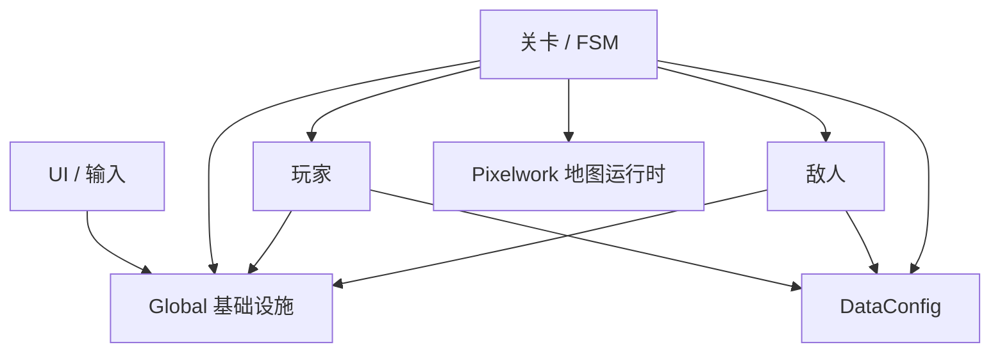
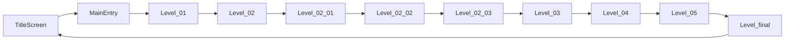
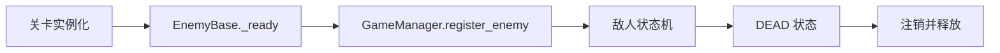
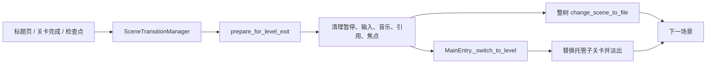

# HackathonGame 技术架构报告

> 唯一架构文档
>
> 更新日期：2026-08-31
>
> 目标引擎：Godot 4.6，GL Compatibility
>
> 文档依据：当前仓库静态扫描、关键链路检查与既有主场景 headless 启动验证；本次仅更新文档，未修改运行时代码、场景或资源

## 1. 项目定位与当前规模

本项目是一款 2D 横版动作叙事游戏，核心主题为“岭南文化 × 赛博未来 × 梦境撕裂”。游戏已经具备完整主线、玩家与敌人战斗系统、四阶段 Boss、剧情交互、数据配置、HUD、音频和像素地图运行时。

以下规模只统计游戏内容，排除 `LevelModule/Backup/`、`addons/godot_ai/` 和 Agent/MCP 工具文件：

| 类型 | 数量 |
|---|---:|
| GDScript (`.gd`) | 83 |
| 场景 (`.tscn`) | 38 |
| Resource 配置 (`.tres`) | 20 |
| Shader (`.gdshader`) | 8 |

项目入口在 `project.godot` 中配置为 `UI/TitleScreen.tscn`，基准视口为 1280×720，拉伸模式为 `canvas_items`。

## 2. 仓库分层

```text
project.godot
├─ .agents/ / .codex/   Agent 规则、Skills、MCP 团队模板与本机配置边界
├─ addons/godot_ai/     Godot AI 编辑器插件；不属于导出后的游戏运行架构
├─ Global/               全局状态、事件、输入、转场、音频
├─ LevelModule/
│  ├─ Formal/            正式关卡、FSM、Builder、关卡数据
│  └─ Scenes/            Pixelwork 地图及运行时脚本
├─ PlayerModule/Formal/  玩家基类、三种角色形态、相机
├─ EnemyModule/Formal/   敌人基类、普通敌人、花旦 Boss
├─ DataConfig/           玩家、敌人、关卡、技能 Resource
├─ UI/                   标题页、HUD、按键设置
├─ Tools/                弹体、交互物、伤害、代码雨等复用组件
├─ Assets/               图像、动画、音频、视频、UI 素材
└─ Resources/            共享资源
```

依赖方向应保持为：



跨模块通信优先经过 `EventBus` 和 `GameManager`。场景切换由专职的 `SceneTransitionManager` 统一协调：所有整树换场景和检查点重启都必须经过它；`EventBus` 只负责传递事件，不直接执行场景切换；`GameManager` 只保存必要的跨场景状态和检查点。关卡可以装配玩家、敌人和 UI，但玩家或敌人不应反向依赖具体关卡脚本。

## 3. 主流程与场景生命周期

### 3.1 主线顺序



`TitleScreen` 通过 `SceneTransitionManager` 进入 `MainEntry`。`MainEntry` 实例化 `Level_01`，订阅 `LEVEL_COMPLETE`，并在前半段流程中以替换子节点的方式承载关卡。

`SceneTransitionManager` 是关卡切换的专职协调器，不是可选工具类。它是整树 `change_scene_to_file()` 的唯一入口，也负责检查点重启、重复请求保护和转场前的公共清理。清理顺序包括调用当前关卡或入口的 `prepare_for_level_exit()`、解除暂停、清空 `GameManager` 的玩家/关卡/敌人/Boss 临时引用、强制解除输入屏蔽、清除音乐暂停状态和释放 GUI 焦点；目标路径会在真正切换前校验，并在关键步骤间等待帧完成。普通关卡、标题页和 HUD 不得直接调用 `SceneTree.change_scene_to_file()` 或自行复制这套全局清理。

在 `MainEntry` 托管模式下，`MainEntry` 只拥有子关卡的释放、实例化和淡入淡出编排：它接收 `LEVEL_COMPLETE`，调用 `SceneTransitionManager.cleanup_for_transition()` 后替换当前子节点。检查点重启也由 `SceneTransitionManager` 统一分流，当前根节点支持 `_switch_to_level()` 时复用托管切换，否则走整树切换或当前场景重载。这样可以保留两种生命周期的现状，同时保证清理协议只有一个实现来源。

当前转场模型并未完全统一：

- `Level_03` 在 `MainEntry` 托管时发送 `LEVEL_COMPLETE`，独立运行时直接切场景。
- `Level_04` 当前直接请求切换到 `Level_05`。
- `Level_05` 当前直接请求切换到 `Level_final`。
- 因此从 `Level_04` 离开后会替换整棵场景树，`MainEntry` 不再继续托管后半段流程。

这是现状描述，不是推荐的新关卡模板。后续应统一为一种主线转场模式，避免两种生命周期并存。

### 3.2 Level 02 的梦境分支

`Level_02_03` 是关键的数据分岔点：

```mermaid
flowchart TD
    CHAT[终端交互] --> MEMORY[/memory]
    MEMORY --> F1[复战区域 01]
    MEMORY --> F2[复战区域 02]
    F1 --> BACK[返回现实房间]
    F2 --> BACK
    BACK --> CONFIG[/config]
    CONFIG --> FLAGS[GameManager.dream_runtime_flags]
    FLAGS --> L3[Level_03 应用能力配置]
```

`/memory` 进入两个复战场景并记录返回原因；完成记忆条件后，`/config` 写入 `GameManager.dream_runtime_flags`。`Level_03` 读取这些标记，应用跳跃能力、伤害减免及外部信号相关规则。

复战流程的当前契约如下：

- `LevelFuzhanSub01` 是进度与文本的集中来源。系统总是选择第一个未完成区域；每区收集 3 个记忆碎片、合计 6 个后才开放 `/config`。
- `LevelFuzhanMemoryBase` 统一承担敌人生成、击杀计数、掉落、叙事冻结、死亡保护和返回现实。每击杀 10 个敌人产生一个待收集物，同一时间只保留一个待收集掉落。
- 收集展示、叙事或玩家死亡期间会冻结敌人和生成计时器。死亡会把生命值保护在 1、保留已收集进度并带失败原因返回现实房间，不显示常规 Game Over。
- `Level_02_03` 消费返回原因、恢复现实房间和终端状态；`/config` 完成重编译后才把能力键写入 `GameManager.dream_runtime_flags`，随后继续到 `Level_03`。
- 返回链兼容两种生命周期：存在 `MainEntry` 托管时发送 `LEVEL_COMPLETE`，否则由 `SceneTransitionManager` 直接切换。

| 所属 | 关键状态或参数 |
|---|---|
| 复战进度 | `memory_recovery_started`、`memory_current_area`、`fuzhan_01_collected`、`fuzhan_02_collected`、`fuzhan_01_complete`、`fuzhan_02_complete`、`memory_fragments`、`core_memory_anchor_stabilized` |
| 返回现实 | `level0203_resume_reality`、`memory_return_reason` |
| 重编译结果 | `player_damage_reduction`、`base_jump_height`、`allow_external_signal`、`dream_version`；核心稳定后另写入 `core_area = "herbal_tea_shop"` |

| 区域 | 玩家出生点 | 相机边界 / 缩放 | 敌人生成 | 掉落范围 | 上限 / 间隔 |
|---|---|---|---|---|---|
| 01 | `(2264, 544)` | `L0 R5328 T-500 B640` / `1.0` | `x=260..5100, y=540` | `x=200..5200, y=560` | `4 / 3s` |
| 02 | `(1816, 512)` | `L0 R4474 T56 B616` / `1.5` | `x=220..4300, y=540` | `x=1800..4300, y=360..536` | `4 / 3s` |

掉落会依据相机安全边距和区域配置再次夹取，并在加入 `DynamicActors` 后校验全局坐标。六种掉落按固定索引推进：月饼、虾饺、木棉、醒狮、烧卖、蒲葵扇；展示由 `DropItem` 与岭南掉落档案界面负责。

`Level_02.tscn` 与 `Level_02_03.tscn` 的 `level_data` 均绑定到正式资源 `DataConfig/Level/Level02Data.tres`。该资源保留了迁移前实际运行的完整文本、数值与音频路径；原 `Level_02_CliffReality` 备份目录已在确认无其他引用后删除，正式流程不再依赖 `Backup/`。

这条 Dictionary 数据链跨越场景边界，键名目前没有编译期检查，是后续配置类型化的重点。以上内容是复战流程的架构基线；剧情台词仍以 `Level_fuzhan_sub01.gd` 和当前正式脚本为准。

## 4. 全局基础设施

`project.godot` 当前注册 8 个游戏运行 Autoload：

| 单例 | 核心职责 |
|---|---|
| `GlobalDefine` | 运行模式、状态、事件名、碰撞层等常量 |
| `EventBus` | 跨模块事件订阅、广播和延迟广播 |
| `GameManager` | 玩家、敌人、关卡、检查点、暂停和跨关卡状态 |
| `InputManager` | 游戏动作分发、动作屏蔽和全局输入锁 |
| `KeybindManager` | 按键映射读取、修改和持久化 |
| `MusicManager` | BGM 播放、淡入淡出及暂停联动 |
| `SFXManager` | 音效播放、实例管理和防抖 |
| `SceneTransitionManager` | 专职关卡切换协调器：整树切场景、检查点重启、重复请求保护和转场清理 |

Godot AI 插件还会注册编辑器联动专用的 `_mcp_game_helper`。该 helper 用于编辑器启动的游戏进程与 MCP 捕获，不属于上述游戏架构；插件的导出钩子会在构建快照中移除它。当前工具基础设施基线为 Godot AI 3.2.0，项目目标引擎锁定为 Godot 4.6 分支，不随上游版本自动迁移。3.2.0 的自定义工具入口默认不在 Codex 白名单内，只有项目提交了经过审查的注册实现后才可另行开放。版本化的 MCP 团队基线位于 `.codex/config.example.toml`，本机活动配置 `.codex/config.toml` 被 Git 忽略；项目作用域、权限和协作规则以 `.codex/README.md` 为准。

### 4.1 运行模式

`GameManager` 根据当前场景路径区分正式模式和 `SelfTest` 模式。正式主线与局部测试场景共享核心模块，但测试场景不得写入正式场景链路或成为正式资源依赖。

### 4.2 全局状态边界

允许跨场景保留的状态应集中在 `GameManager`，例如：

- `player_ref`、`current_level`
- `enemy_list`
- 暂停、游戏结束、对话状态
- 检查点状态
- `dream_runtime_flags`

任何临时关卡状态如果写入全局层，都必须在转场或新流程开始时明确清理。`GameManager.restart_from_checkpoint()` 只记录/重置状态并委托 `SceneTransitionManager`，不应在 `GameManager` 内新增场景装载逻辑。

### 4.3 EventBus 当前契约

`EventBus` 是跨模块事件通道，不承担节点装配或场景切换。当前实现已经覆盖以下订阅生命周期修复：

- `subscribe()` 校验节点实例和回调方法是否存在；同一事件下同一节点/方法重复订阅会自动去重。
- 订阅节点退出场景树时自动执行 `unsubscribe_all()`，并在广播时再次跳过失效节点或已不存在的回调。
- `emit()` 遍历监听者副本，允许回调过程中修改订阅而不破坏当前遍历；`emit_deferred()` 将事件集中排队到下一次处理阶段。
- 事件名仍统一来自 `GlobalDefine.EventName`，payload 仍是未做编译期字段检查的 `Dictionary`。

需要特别注意当前行为边界：虽然 `emit()` 的注释写作“立即执行”，实际 `_safe_call()` 使用 `call_deferred()` 调度回调，因此 `emit()` 不提供同步完成语义，也不能返回订阅者的执行结果。它降低了回调对广播遍历的副作用，但并不等同于真正的异常捕获；依赖事件处理已完成的代码必须显式改为后续状态或信号协议。

## 5. 核心数据流

### 5.1 输入到战斗


玩家持续移动和跳跃采用每帧轮询；离散动作通过 `InputManager` 分发。伤害由通用计算器和目标配置共同决定，结果再通过 `EventBus` 投递到 HUD、关卡目标和特效；事件回调的延迟语义见 4.3 节。

### 5.2 敌人生命周期



敌人基类已经在 `_ready()` 自动注册。任何生成器在 `add_child()` 后再次手工注册，都会造成同一实例重复出现在 `enemy_list`。

### 5.3 场景切换



`SceneTransitionManager` 是这条链的中心；`MainEntry` 只在托管模式下负责子节点编排。转场必须恢复暂停、输入、音乐、玩家和敌人引用，并清理只属于当前场景的对话或 UI 状态。当前公共清理仍未复位 `GameManager.is_dialog_active`，因此该布尔值污染下一关仍是待修复风险。

### 5.4 地图数据

Pixelwork 生成数据由 `LevelModule/Scenes/PixelworkMapStitch/` 下的运行时脚本读取，再生成地图层、碰撞和关卡节点。地图源数据与运行时装配脚本必须同步维护；只替换图片而不更新碰撞数据，会产生视觉和物理边界不一致。

项目不再包含 `AI资源库` 或 `addons/npc_library_tool`。现有 Pixelwork 运行时脚本仍保留对 `NpcLibraryRuntimeGate` 的可选探测；插件缺失时会发出提示并退回完整地图加载，不构成启动时的硬依赖。若后续清理生成代码，必须先验证所有相关地图的加载、碰撞与性能表现。

## 6. 关卡架构

正式关卡通常由以下部分组成：

- 主场景 `.tscn`
- 主控脚本 `.gd`
- FSM 或阶段枚举
- SceneBuilder / UIBuilder
- `LevelConfig` 或关卡专用数据资源
- Pixelwork 地图运行时（部分关卡）

| 关卡 | 主要职责 |
|---|---|
| `Level_01` | 教学、基础交互和叙事引导 |
| `Level_02`～`Level_02_03` | 多段梦境流程、终端、记忆复战和配置注入 |
| `Level_03` | 应用跨关卡配置、城市场景、能力变化和战斗推进 |
| `Level_04` | 维度侵蚀、空间崩塌和世界切换 |
| `Level_05` | 双世界、双角色独立血量、侵蚀值、花旦 Boss 韧性/眩晕和技能二流程 |
| `Level_final` | 终局展示并返回标题页 |

复杂度较高的脚本包括：

| 文件 | 当前行数 |
|---|---:|
| `Level_02_03.gd` | 1969 |
| `Level_05.gd` | 1419 |
| `Level_03.gd` | 1317 |
| `Level_04.gd` | 1311 |
| `Enemy_BossHuadan.gd` | 1163 |

这些文件同时承担阶段状态、生成、剧情、UI 和转场，后续优先按“阶段控制器 + 配置资源 + Builder”拆分。

## 7. 玩家、敌人与 Boss

### 7.1 玩家

`PlayerBase` 负责通用生命、受伤、死亡、状态切换、输入接入和事件同步。三个正式形态在基类之上扩展：

- `Player_Warrior`
- `Player_Warrior_Cyber`
- `Player_Warrior_Lingnan`

6 月末至 7 月的能力增量已进入当前运行时链：赛博形态提供技能二并由 HUD 展示按键/冷却，花旦 Boss 增加韧性、破韧眩晕和阶段化攻击；这些行为由玩家、HUD、`Level_05` 与 Boss 之间的现有接口协作，不应重新复制一套关卡专用输入或战斗总线。

`SmoothCamera` 负责跟随与关卡边界。形态切换时需要同步位置、方向、摄像机限制、能力标记和对应生命值。

### 7.2 普通敌人

`EnemyBase` 提供感知、追踪、攻击、受伤、死亡和全局注册。具体敌人通过 `EnemyConfig` 和子类行为扩展。玩家范围攻击会遍历 `GameManager.enemy_list`，因此列表必须满足实例唯一性。

### 7.3 花旦 Boss

花旦 Boss 使用独立多阶段逻辑，包含阶段转换、攻击模式、剑气、灯笼/演出、韧性/破韧眩晕和死亡收束。`Level_05` 同时展示 Boss 血条与韧性条。Boss 继承通用敌人语义，但对阶段、韧性和死亡流程有重写；修改基类生命周期时必须同时检查 Boss 重写。阶段阈值和韧性参数当前仍在脚本常量中，后续若要平衡化应迁移到 `DataConfig`，并保持运行时状态与配置分离。

## 8. UI、音频与视觉层

### 8.1 HUD

`UI/HUD.gd` 订阅生命、Boss、侵蚀、任务和关卡事件，负责常驻战斗信息、暂停界面及部分关卡特效。HUD 的通用关卡判断应通过 `GameManager.current_level`，不应只依赖 `SceneTree.current_scene`，因为前半段关卡是 `MainEntry` 的子节点；当前 `_is_code_rain_pause_scene()` 仍有依赖 `current_scene` 的例外路径，属于第 10.1 节的待修复风险。

### 8.2 音频

`MusicManager` 管理 BGM，`SFXManager` 管理短音效。关卡配置可保存音频路径，但运行时加载前应检查资源存在性，避免缺失资源直接产生错误日志。

### 8.3 Shader 与工具

项目包含代码雨、侵蚀、警告屏障、弹体和其他视觉工具。Shader 或材质在 headless/dummy 渲染器下的结果不能完全代表图形后端，涉及画面效果的修复必须再做一次可视化检查。

## 9. 配置与资源边界

`DataConfig/` 使用 `.tres` 将部分平衡参数与脚本分离：

- `PlayerConfig`：生命、移动、跳跃、攻击等
- `EnemyConfig`：生命、速度、感知、伤害等
- `LevelConfig` / 关卡数据：出生点、相机范围、流程文本、下一关路径等
- 技能配置：冷却、伤害和技能参数

6 月后的整理重点是资源链路而不是另起一套配置系统：正式关卡继续引用 `DataConfig/Level/Level0xConfig.tres` 和对应的关卡数据资源；`Level02Data` 仍是 `Level_02`、`Level_02_03` 的正式文本/谜题/音频挂点来源，而复战区域的运行时进度与常量由 `LevelFuzhanSub01` 统一维护并写入 `GameManager.dream_runtime_flags`。7～8 月的整理修复了多份旧的脚本/资源 UID 引用，补齐了当前资源类的 `.gd.uid`，并移除了 `LevelModule/Backup/` 中已不再使用的 Level 02 快照；修改 `.tres` 或 `.tscn` 时仍不得手工编造 UID。

当前 `SkillConfig` 已正式存在并被 `SlashConfig.tres` 使用，但赛博角色技能二和花旦 Boss 的韧性/阶段阈值仍主要是脚本常量，不能把它们误写成已经完全数据驱动。

原则：

1. 数值平衡优先进入 Resource，不继续散落在关卡脚本中。
2. 正式场景只能引用正式配置路径。
3. `Backup/` 只保存历史参考，不得与正式资源共用 UID。
4. 所有资源路径大小写必须与磁盘文件名完全一致，以保证 Windows、Web 和 Linux 行为一致。
5. 资源可选时先用 `ResourceLoader.exists()` 检查；资源必需时应在启动验证中明确失败。

## 10. 已确认问题与修复边界

### 10.1 仍需直接修复的代码问题

以下问题不需要新增美术、音频、文案或策划数值：

| 优先级 | 问题 | 影响 |
|---|---|---|
| P0 | 敌人在 `_ready()` 自动注册后又被部分生成器手工注册 | 范围攻击可能对同一实例重复结算，注销后残留条目 |
| P0 | `Level_03` 通过受伤后回血实现减伤 | 致死攻击可能先进入死亡/失败状态，再被延迟回血 |
| P0 | 转场清理未复位对话状态 | 下一关敌人可能持续无法锁定玩家 |
| P1 | `EventBus` 的订阅生命周期修复已落地，但 `emit()` 仍通过 `call_deferred()` 调用回调 | 不能提供同步完成语义；`_safe_call()` 也不是真正的异常捕获边界 |
| P1 | 输入屏蔽只使用全局计数，没有所有者 | 一个模块可能误解除另一个模块的输入锁 |
| P1 | HUD 使用 `current_scene` 判断正式关卡 | `MainEntry` 托管时关卡专属效果判断错误 |
| P1 | 敌人资源目录存在大小写不一致引用 | Windows 可运行，但 Web/Linux 导出存在加载失败风险 |

### 10.2 已落地修复的边界

本轮核对确认以下事项已经在当前代码中成立，后续修改应保持这些契约：

- `SceneTransitionManager` 已作为专职切换 Autoload 提供整树切换、检查点重启、公共清理和重复请求保护；`MainEntry` 托管切换必须复用其清理入口。
- `EventBus` 已具备节点有效性校验、同事件幂等订阅、退出场景树自动清理、失效监听者跳过和延迟事件队列。
- `DataConfig` 的正式 Resource 分类、关卡数据绑定和当前 UID 链路已统一；Level 02 正式运行不依赖 `Backup/` 快照。
- `EnemyBase` 与花旦 Boss 当前已先设置 `is_dead` 再切换 `DEAD`，避免死亡状态切换被自身的早退条件拦截；后续改动仍需同时检查两者的死亡重写。

这些修复不代表下方残余风险已经消失，尤其是 `is_dialog_active` 清理、敌人重复注册和 `emit()` 的同步语义仍需单独处理。

### 10.3 需要架构决策但不需要新资产

| 问题 | 需要决定的事项 |
|---|---|
| 主线存在两种转场模型 | 统一由 `MainEntry` 托管，或明确从某关开始整树切换 |
| `dream_runtime_flags` 使用字符串 Dictionary | 是否改为强类型 Resource 或专用数据对象 |
| 大型关卡脚本职责过多 | 确定按阶段、系统还是场景区域拆分 |

### 10.4 需要资产或人工验证

| 问题 | 外部条件 |
|---|---|
| `Assets/UI/skill_icon.png` 缺失 | 需要补图；代码只能安全降级为文本 |
| `Level02Data.tres` 的三条音频路径缺失 | 需要提供音频或人工选择替代资源 |
| `WarningBarrier` 材质在 dummy 渲染器报错 | 需要图形环境进行视觉 QA |
| Git 对象体积较大 | 历史清理或 Git LFS 迁移需要团队协作决定 |

## 11. 开发与扩展约定

### 11.1 新增关卡

1. 继承 `LevelBase` 或沿用正式关卡初始化协议。
2. 将阶段流转放入 FSM，将节点构建放入 Builder。
3. 通过配置资源提供出生点、相机边界、文本和下一关路径。
4. 使用统一的主线转场协议。
5. 为转场实现输入、暂停、音频、对话和全局引用清理。

### 11.2 新增敌人

1. 继承 `EnemyBase`。
2. 新增独立 `EnemyConfig`。
3. 生成后依赖基类自动注册，不再手工注册。
4. 死亡时只执行一次状态切换、注销和释放。
5. 验证单体伤害、范围伤害、暂停与转场行为。

### 11.3 新增事件

1. 在 `GlobalDefine.EventName` 定义事件常量。
2. 明确 payload 字段和类型。
3. 使用 `EventBus.subscribe()` / `emit()`。
4. 节点退出时确保连接和订阅被清理。
5. 不在业务脚本里散落字符串事件名。

### 11.4 新增资源

1. 使用 `res://` 规范路径并保持大小写一致。
2. 确认导入文件和源文件同时存在。
3. 不复用备份资源 UID。
4. 在目标 Godot 版本中重新导入并验证场景。
5. 音画资产必须进行人工试听或视觉确认。

## 12. 当前验证基线

本次扫描确认：

- 主要 GDScript 均可解析，未发现语法错误。
- 标题页和主线主要场景均可实例化并完成 `_ready()`。
- 本机 Godot 4.6 headless 启动主场景成功。
- 项目目前没有自动化单元测试或持续集成基线。
- Godot 4.6.3 全量 UID 审计未发现重复 UID、无效 UID 或 UID 与文本路径不一致；Level 02 数据已经迁入正式 `DataConfig`，原备份依赖已移除。
- 强制短时退出会出现资源仍在使用的退出日志，不等同于正常游玩崩溃。

每轮结构性修改至少执行：

1. `git diff --check`
2. 本机 Godot 4.6 headless 主场景启动
3. 受影响关卡独立实例化
4. 正式主线相邻场景转场验证
5. 涉及 shader、动画、音频时追加人工画面或试听检查

## 13. 当前工作顺序建议

1. 先修复第 10.1 节的 P0 纯代码问题。
2. 再处理 P1 的事件、输入、HUD 和跨平台路径问题。
3. 决定并统一主线转场模型。
4. 补齐缺失 UI 与音频资产。
5. 为主线、伤害结算、转场清理和敌人注册建立最小自动化回归测试。

这份文件是仓库唯一架构文档。架构、主线流程、全局契约或风险状态发生变化时，应直接更新本文件，避免再创建并行版本。
