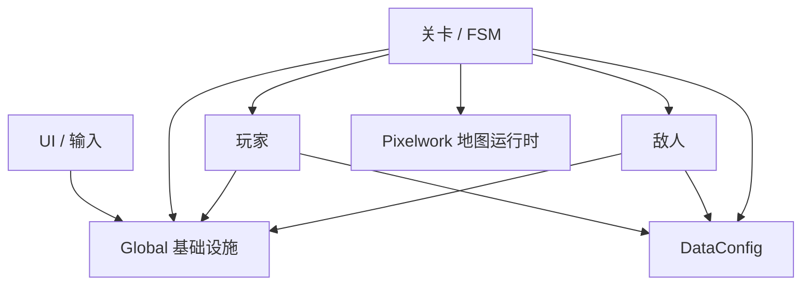
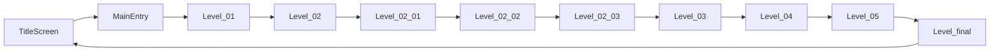

# HackathonGame 技术架构报告

> 唯一架构文档
>
> 更新日期：2026-09-01
>
> 目标引擎：Godot 4.6，GL Compatibility
>
> 文档依据：当前仓库静态扫描、关键链路检查与主场景 headless 启动验证

## 1. 项目定位与当前规模

本项目是一款 2D 横版动作叙事游戏，核心主题为“岭南文化 × 赛博未来 × 梦境撕裂”。游戏已经具备完整主线、玩家与敌人战斗系统、四阶段 Boss、剧情交互、数据配置、HUD、音频和像素地图运行时。

以下规模只统计游戏内容，排除 `LevelModule/Backup/`、`addons/godot_ai/` 和 Agent/MCP 工具文件：

| 类型 | 数量 |
|---|---:|
| GDScript (`.gd`) | 87 |
| 场景 (`.tscn`) | 38 |
| Resource 配置 (`.tres`) | 26 |
| Shader (`.gdshader`) | 8 |

项目入口在 `project.godot` 中配置为 `UI/TitleScreen.tscn`，基准视口为 1280×720，拉伸模式为 `canvas_items`。

## 2. 仓库分层

```text
project.godot
├─ .agents/ / .codex/   Agent 规则、Skills、MCP 团队模板与本机配置边界
├─ addons/godot_ai/     Godot AI 编辑器插件；不属于导出后的游戏运行架构
├─ Global/               全局状态、事件、输入、转场、音频
├─ LevelModule/
│  ├─ Formal/            正式关卡、FSM、Builder、关卡数据
│  └─ Scenes/            Pixelwork 地图及运行时脚本
├─ PlayerModule/Formal/  玩家基类、三种角色形态、相机
├─ EnemyModule/Formal/   敌人基类、普通敌人、花旦 Boss
├─ DataConfig/           玩家、敌人、关卡、技能 Resource
├─ UI/                   标题页、HUD、按键设置
├─ Tools/                弹体、交互物、伤害、代码雨等复用组件
├─ Assets/               图像、动画、音频、视频、UI 素材
└─ Resources/            共享资源
```

依赖方向应保持为：



跨模块通信优先经过 `EventBus` 和 `GameManager`。关卡可以装配玩家、敌人和 UI，但玩家或敌人不应反向依赖具体关卡脚本。

## 3. 主流程与场景生命周期

### 3.1 主线顺序



`TitleScreen` 通过 `SceneTransitionManager` 进入 `MainEntry`。`MainEntry` 实例化 `Level_01`，订阅 `LEVEL_COMPLETE`，并在前半段流程中以替换子节点的方式承载关卡。

当前转场模型并未完全统一：

- `Level_03` 在 `MainEntry` 托管时发送 `LEVEL_COMPLETE`，独立运行时直接切场景。
- `Level_04` 当前直接请求切换到 `Level_05`。
- `Level_05` 当前直接请求切换到 `Level_final`。
- 因此从 `Level_04` 离开后会替换整棵场景树，`MainEntry` 不再继续托管后半段流程。

这是现状描述，不是推荐的新关卡模板。后续应统一为一种主线转场模式，避免两种生命周期并存。

### 3.2 Level 02 的梦境分支

`Level_02_03` 是关键的数据分岔点：

```mermaid
flowchart TD
    CHAT[终端交互] --> MEMORY[/memory]
    MEMORY --> F1[复战区域 01]
    MEMORY --> F2[复战区域 02]
    F1 --> BACK[返回现实房间]
    F2 --> BACK
    BACK --> CONFIG[/config]
    CONFIG --> FLAGS[GameManager.DreamRuntimeState]
    FLAGS --> L3[Level_03 应用能力配置]
```

`/memory` 进入两个复战场景并记录返回原因；完成记忆条件后，`/config` 把配置结果写入 `GameManager.dream_runtime_state`。`Level_03` 当前仍通过 `dream_runtime_flags` 兼容字典读取这些标记，减伤恢复为 `PLAYER_HURT` 后的旧回补逻辑。三种玩家形态、Slash、关卡流程和敌人行为的正式数值均由对应 DataConfig 资源提供。

复战流程的当前契约如下：

- `LevelFuzhanSub01` 是进度与文本的集中入口，目标数量读取 `Level02Data.memory_fragments_per_area` 与 `memory_total_fragments`；当前正式资源配置为每区 3 个、合计 6 个。
- `LevelFuzhanMemoryBase` 统一承担敌人生成、击杀计数、掉落、叙事冻结、死亡保护和返回现实。掉落阈值读取 `Level02Data.memory_kills_per_drop`（当前为 10），同一时间只保留一个待收集掉落。
- 收集展示、叙事或玩家死亡期间会冻结敌人和生成计时器。死亡会把生命值保护在 1、保留已收集进度并带失败原因返回现实房间，不显示常规 Game Over。
- `Level_02_03` 消费返回原因、恢复现实房间和终端状态；`/config` 完成重编译后才把能力键写入类型化运行时状态，随后继续到 `Level_03`。
- 返回链兼容两种生命周期：存在 `MainEntry` 托管时发送 `LEVEL_COMPLETE`，否则由 `SceneTransitionManager` 直接切换。

| 所属 | 关键状态或参数 |
|---|---|
| 复战进度 | `memory_recovery_started`、`memory_current_area`、`fuzhan_01_collected`、`fuzhan_02_collected`、`fuzhan_01_complete`、`fuzhan_02_complete`、`memory_fragments`、`core_memory_anchor_stabilized` |
| 返回现实 | `level0203_resume_reality`、`memory_return_reason` |
| 重编译结果 | `player_damage_reduction`、`base_jump_height`、`allow_external_signal`、`dream_version`；核心稳定后另写入 `core_area = "herbal_tea_shop"` |

| 区域 | 玩家出生点 | 相机边界 / 缩放 | 敌人生成 | 掉落范围 | 上限 / 间隔 |
|---|---|---|---|---|---|
| 01 | `(2264, 544)` | `L0 R5328 T-500 B640` / `1.0` | `x=260..5100, y=540` | `x=200..5200, y=560` | `4 / 3s` |
| 02 | `(1816, 512)` | `L0 R4474 T56 B616` / `1.5` | `x=220..4300, y=540` | `x=1800..4300, y=360..536` | `4 / 3s` |

掉落会依据相机安全边距和区域配置再次夹取，并在加入 `DynamicActors` 后校验全局坐标。六种掉落按固定索引推进：月饼、虾饺、木棉、醒狮、烧卖、蒲葵扇；展示由 `DropItem` 与岭南掉落档案界面负责。

`Level_02.tscn` 与 `Level_02_03.tscn` 的 `level_data` 均绑定到正式资源 `DataConfig/Level/Level02Data.tres`。该资源保留了迁移前实际运行的完整文本、数值与音频路径；原 `Level_02_CliffReality` 备份目录已在确认无其他引用后删除，正式流程不再依赖 `Backup/`。

这条 Dictionary 数据链跨越场景边界，键名目前没有编译期检查，是后续配置类型化的重点。以上内容是复战流程的架构基线；剧情台词仍以 `Level_fuzhan_sub01.gd` 和当前正式脚本为准。

## 4. 全局基础设施

`project.godot` 当前注册 8 个游戏运行 Autoload：

| 单例 | 核心职责 |
|---|---|
| `GlobalDefine` | 运行模式、状态、事件名、碰撞层等常量 |
| `EventBus` | 跨模块事件订阅、广播和延迟广播 |
| `GameManager` | 玩家、敌人、关卡、检查点、暂停和跨关卡状态 |
| `InputManager` | 游戏动作分发、动作屏蔽和全局输入锁 |
| `KeybindManager` | 按键映射读取、修改和持久化 |
| `MusicManager` | BGM 播放、淡入淡出及暂停联动 |
| `SFXManager` | 音效播放、实例管理和防抖 |
| `SceneTransitionManager` | 校验并受理切场景请求，以逐帧状态机完成清理、切换和解锁；同时负责检查点重启 |

Godot AI 插件还会注册编辑器联动专用的 `_mcp_game_helper`。该 helper 用于编辑器启动的游戏进程与 MCP 捕获，不属于上述游戏架构；插件的导出钩子会移除该 Autoload，Web 导出预设还会排除整个 `addons/godot_ai/` 与 `Tests/`，避免把编辑器服务和自测夹具打进正式资源包。当前已提交的工具基础设施基线为 Godot AI 3.2.0，项目目标引擎锁定为 Godot 4.6 分支，不随上游版本自动迁移；3.2.0 的自定义工具入口默认不在 Codex 白名单内，只有项目提交了经过审查的注册实现后才可另行开放。版本化的 MCP 团队基线位于 `.codex/config.example.toml`，本机活动配置 `.codex/config.toml` 被 Git 忽略；项目作用域、权限和协作规则以 `.codex/README.md` 为准。

### 4.1 运行模式

`GameManager` 根据当前场景路径区分正式模式和 `SelfTest` 模式，并在 Autoload 就绪后延迟复核一次，避免 Autoload `_ready()` 早于 `current_scene` 建立。正式主线与局部测试场景共享核心模块，但测试场景不得写入正式场景链路或成为正式资源依赖；测试目录不会进入 Web 正式包。

### 4.2 全局状态边界

允许跨场景保留的状态应集中在 `GameManager`，例如：

- `player_ref`、`current_level`
- `enemy_list`
- 暂停、游戏结束、按 owner 计数的对话状态
- 检查点状态
- `DreamRuntimeState` 类型化跨关卡状态

`dream_runtime_flags` 仅作为旧代码兼容属性：读取返回深拷贝，整表赋值会经过类型校验。新增代码应使用 `dream_runtime_state`、`set_dream_flag()` 和 `get_dream_flag()`；不能对兼容属性返回的 Dictionary 做原地修改。已知键由 `DreamRuntimeState.VALUE_TYPES` 校验，未知赛题键暂时透传，以便赛题发布后扩展。 `Level_03` 因本次稳定性回退暂时保留兼容字典读取，不能作为新增关卡模板。

任何临时关卡状态如果写入全局层，都必须在转场或新流程开始时明确清理。`SceneTransitionManager.cleanup_for_transition()` 统一复位暂停、游戏结束、玩家/敌人引用、Boss、对话 owner、输入锁、动作锁、音乐暂停和 UI 焦点，但保留同一局需要跨关卡延续的梦境状态与检查点。标题页两个新局入口统一调用 `GameManager.begin_new_run()`，在临时状态复位之外继续清空 `DreamRuntimeState`、检查点场景、阶段和数据，禁止上一局进度污染新流程。

### 4.3 事件与输入锁契约

`EventBus.emit()` 是同步中介者分发：返回前按订阅顺序完成当前监听快照；回调中订阅或退订只影响下一次发射。需要跨帧时必须显式调用 `emit_deferred()`；入队时会深拷贝 payload，延迟队列在暂停状态下也会继续排空。订阅以 `owner + method` 幂等去重，owner 离树后自动清理；同一 owner 可为同一事件登记多个方法，并可按 method 精确退订。`subscribe()` 默认建立场景级订阅，`subscribe_persistent()` 只用于 `MusicManager`、`SFXManager` 等确需覆盖整个应用生命周期的 Autoload 监听。场景隔离和测试清场使用 `clear_transient()`：它移除场景级订阅并取消未投递的延迟事件，但保留应用级订阅；`clear_all()` 只用于进程退出或明确的完全重置。玩家、敌人、关卡、交互、伤害和生命事件在分发前校验最小 payload 字段与类型。

`InputManager` 的全局锁与动作锁都按 owner 管理。`block_input()` 返回 token；可通过 `unblock_input_token()` 精确释放，或使用 `owner + reason` 配对释放。owner 离树会自动释放其全部锁，转场则执行最终兜底清理。事件分发和玩家每帧轮询必须共用 `is_gameplay_input_blocked()`：锁定时方向为零、跳跃不得起跳，尚未开始的长按动作不得计时；已经进入蓄力或冲刺前摇的动作暂停计时，不能把锁定期间读到的“松键”解释为释放技能。

## 5. 核心数据流

### 5.1 输入到战斗


玩家持续移动和跳跃采用每帧轮询；离散动作通过 `InputManager` 分发。两条输入路径都必须服从同一个全局锁判断，Cyber 与 Lingnan 的长按普攻、技能蓄力和冲刺前摇也不得绕过该锁。敌人受伤链仍由 `DamageCalculator` 与 `EnemyBase.take_damage()` 统一结算，并同步发射 `damage_applied`。玩家受伤链已恢复改动前行为：直接扣血后发射 `PLAYER_HURT` 与 `HEALTH_CHANGED`；`Level_03` 的梦境减伤由事件回调回补生命，因此不再宣称具备扣血前倍率结算。

### 5.2 敌人生命周期


敌人基类在 `_ready()` 自动注册，生成器不得再手工注册。`GameManager.register_enemy()` 同时提供幂等保护，离树回调和读取前清理保证 `enemy_list` 只包含唯一、有效、未死亡实例。死亡流程先进入 `DEAD`，再设置死亡标记、注销、同步广播并淡出释放。

### 5.3 场景切换


整树转场必须先确认目标路径存在且能加载为 `PackedScene`，再触碰当前场景状态；无效目标只告警，不调用退出钩子、不清输入锁、不重置运行状态。目标有效后，转场必须恢复暂停、输入、音乐、玩家和敌人引用，并清理只属于当前场景的对话或 UI 状态。遗漏的全局布尔值会污染下一关。

`request_scene_change()` 只负责受理有效请求，后续由 `SceneTransitionManager` 的逐帧阶段机执行“清理 → 等待一帧 → 切换 → 等待一帧 → 解锁”；调用方不需要持有或等待协程。`MainEntry` 的子场景遮罩淡入淡出同样由节点自身的逐帧状态驱动，退出时清空待执行回调，避免承载节点释放后仍有悬空恢复点。

### 5.4 地图数据

Pixelwork 生成数据由 `LevelModule/Scenes/PixelworkMapStitch/` 下的运行时脚本读取，再生成地图层、碰撞和关卡节点。地图源数据与运行时装配脚本必须同步维护；只替换图片而不更新碰撞数据，会产生视觉和物理边界不一致。

项目不再包含 `AI资源库` 或 `addons/npc_library_tool`。现有 Pixelwork 运行时脚本仍保留对 `NpcLibraryRuntimeGate` 的可选探测；插件缺失时会发出提示并退回完整地图加载，不构成启动时的硬依赖。若后续清理生成代码，必须先验证所有相关地图的加载、碰撞与性能表现。

## 6. 关卡架构

正式关卡通常由以下部分组成：

- 主场景 `.tscn`
- 主控脚本 `.gd`
- FSM 或阶段枚举
- SceneBuilder / UIBuilder
- `LevelConfig` 或关卡专用数据资源
- Pixelwork 地图运行时（部分关卡）

| 关卡 | 主要职责 |
|---|---|
| `Level_01` | 教学、基础交互和叙事引导 |
| `Level_02`～`Level_02_03` | 多段梦境流程、终端、记忆复战和配置注入 |
| `Level_03` | 应用跨关卡配置、城市场景、能力变化和战斗推进 |
| `Level_04` | 维度侵蚀、空间崩塌和世界切换 |
| `Level_05` | 双世界、双角色独立血量、侵蚀值和花旦 Boss |
| `Level_final` | 终局展示并返回标题页 |

复杂度较高的脚本包括：

| 文件 | 当前行数 |
|---|---:|
| `Level_02_03.gd` | 1969 |
| `Level_05.gd` | 1419 |
| `Level_03.gd` | 1317 |
| `Level_04.gd` | 1311 |
| `Enemy_BossHuadan.gd` | 1163 |

这些文件同时承担阶段状态、生成、剧情、UI 和转场，后续优先按“阶段控制器 + 配置资源 + Builder”拆分。

## 7. 玩家、敌人与 Boss

### 7.1 玩家

`PlayerBase` 负责通用生命、受伤、死亡、状态切换、输入接入和事件同步。三个正式形态在基类之上扩展：

- `Player_Warrior`
- `Player_Warrior_Cyber`
- `Player_Warrior_Lingnan`

`SmoothCamera` 负责跟随与关卡边界。形态切换时需要同步位置、方向、摄像机限制、能力标记和对应生命值。

### 7.2 普通敌人

`EnemyBase` 提供感知、追踪、攻击、受伤、死亡和全局注册。具体敌人通过 `EnemyConfig` 和子类行为扩展。玩家范围攻击会遍历 `GameManager.enemy_list`，因此列表必须满足实例唯一性。

### 7.3 花旦 Boss

花旦 Boss 使用独立多阶段逻辑，包含阶段转换、攻击模式、剑气、灯笼/演出和死亡收束。Boss 继承通用敌人语义，但对阶段和死亡流程有重写；修改基类生命周期时必须同时检查 Boss 重写。

## 8. UI、音频与视觉层

### 8.1 HUD

`UI/HUD.gd` 订阅生命、Boss、侵蚀、任务和关卡事件，负责常驻战斗信息、暂停界面及部分关卡特效。HUD 应通过 `GameManager.current_level` 判断实际关卡，不应只依赖 `SceneTree.current_scene`，因为前半段关卡是 `MainEntry` 的子节点。

### 8.2 音频

`MusicManager` 管理 BGM，`SFXManager` 管理短音效。关卡配置可保存音频路径，但运行时加载前应检查资源存在性，避免缺失资源直接产生错误日志。BGM 淡入、交叉淡化和淡出由 `MusicManager` 自身的逐帧状态机驱动；退役播放器必须停止、清空 stream 并同步释放。两个音频管理器在退出时都要停止播放器并断开资源引用，保证短时自测退出不会遗留音频播放资源。

### 8.3 Shader 与工具

项目包含代码雨、侵蚀、警告屏障、弹体和其他视觉工具。Shader 或材质在 headless/dummy 渲染器下的结果不能完全代表图形后端，涉及画面效果的修复必须再做一次可视化检查。

## 9. 配置与资源边界

`DataConfig/` 是正式玩法数值的运行时权威来源。当前边界如下：

- `PlayerConfig / WarriorConfig.tres`：三形态共享的生命、移动、跳跃、攻击、冲刺、受击、镜头跟随和梯子攀爬参数
- `CyberPlayerConfig.tres`、`LingnanPlayerConfig.tres`：各形态独有技能、反击、蓄力、位移、判定、护盾和反馈节奏
- `SkillConfig / SlashConfig.tres`：Slash 与剑气的伤害、类型、暴击、范围、动作时长、速度和最大距离
- `EnemyConfig` 的各正式 `.tres`：敌人基础反馈与具体原型实际使用的移动、跳跃、连击、冲撞、悬浮、弹体和伤害类型；共享类是多个原型的字段超集，普通敌人资源只显式写出基类与该原型会读取的字段
- `BossHuadanConfig.tres`、`BossHuadanBehaviorConfig.tres` 与 `BossDecisionProfile`：Boss 阶段数值、韧性、召唤、剑气、动作节奏和分阶段权重决策
- `LevelConfig`、`Level01Data` 至 `Level05Data`、`LevelFinalData`：正式关卡的玩家/转场路径、出生点、相机、刷怪、交互冷却、概率、距离、侵蚀、谜题、文本和演出时序
- `MemoryRecoveryArea01/02.tres`：两个复战区域各自的出生点、相机、敌人和掉落边界、存活上限与生成间隔

正式消费者不得在配置缺失、数组为空或路径非法时静默退回另一套玩法数值；必需配置应明确报错并停止对应初始化。类脚本中的默认值只承担新建资源时的编辑器模板与最终安全兜底，不是正式资源的第二套平衡表。临时运行时实验不得写回共享 `.tres`，应使用资源副本、实例字段或 `DreamRuntimeState`。

`Tools/ConfigValidator.gd` 验证正式资源类型、路径、范围、概率、数组对应关系、Boss 权重、关卡边界与阶段时序。`Scripts/check_dataconfig_consumers.ps1` 进一步审计所有导出字段是否存在正式运行时消费者、非敌人资源是否显式序列化全部值，以及每个敌人原型实际读取的字段是否在对应 `.tres` 中显式标定。

原则：

1. 数值平衡优先进入 Resource，不继续散落在关卡脚本中。
2. 正式场景只能引用正式配置路径。
3. `Backup/` 只保存历史参考，不得与正式资源共用 UID。
4. 所有资源路径大小写必须与磁盘文件名完全一致，以保证 Windows、Web 和 Linux 行为一致。
5. 资源可选时先用 `ResourceLoader.exists()` 检查；资源必需时应在启动验证中明确失败。
6. 新增导出字段必须在同一改动中接入正式消费者并补齐校验；失效字段应删除，不能保留“看似可调但运行时无效”的假配置。
7. 纯视觉尺寸、颜色、贴图切片、状态枚举和算法哨兵仍留在代码或场景；会改变玩法结果、节奏、流程、概率、距离阈值或测试关键位置的数值进入 DataConfig。

## 10. 已确认问题与修复边界

### 10.1 已完成的纯代码修复

以下问题不需要新增美术、音频、文案或策划数值：

| 优先级 | 原问题 | 当前契约 |
|---|---|---|
| P0 | 敌人自动注册后被生成器重复注册 | 生成器重复入口已移除，`GameManager` 幂等并自动清理 |
| P0 | 转场清理未复位对话状态 | 对话按 owner 计数，转场统一清理 |
| P0 | 敌人和 Boss 的 `DEAD` 状态被早退拦截 | 先切状态再置死亡标记，死亡事件只广播一次 |
| P0 | 新局入口只切模式，上一局梦境状态和检查点会残留 | 标题页入口统一调用 `GameManager.begin_new_run()`，同时复位临时状态和整局进度 |
| P0 | 无效目标转场会先清理当前场景，再发现无法切换 | 目标场景先加载为 `PackedScene`；预检失败保证当前状态原样保留 |
| P0 | `Level_03_Official` 的 `CodeRainOverlay` 未绑定脚本，运行时强类型赋值失败 | 正式场景显式绑定 `Tools/CodeRain.gd`，并纳入场景冒烟清单 |
| P1 | `EventBus` 用延迟调用模拟立即分发，且清场会误删 Autoload 订阅 | `emit()` 同步、`emit_deferred()` 显式跨帧；场景级/应用级订阅、精确退订、payload 校验和 owner 清理均有回归测试 |
| P1 | 输入屏蔽只有全局计数，且玩家轮询和长按动作可绕过锁 | owner、嵌套计数和 token 精确释放已生效；移动、跳跃、蓄力与长按动作共用全局锁判断 |
| P1 | `Level_03` 直接写对话布尔值并用无 owner 方式解锁 | 叙事面板改用 `begin_dialog/end_dialog` 与同 owner 输入锁配对 |
| P1 | 场景冒烟只看进程退出码，会漏报脚本运行时错误 | 测试 runner 接入脚本错误捕获，ERROR 级脚本日志直接判定失败 |
| P1 | HUD 依赖 `current_scene` | 改为读取 `GameManager.current_level` |
| P1 | 可选 HUD 图标缺失会直接调用 `load()` | 先检查资源，缺失时无错误地使用代码文本占位 |
| P1 | 正式资源路径大小写与磁盘不一致，部分 ext_resource 保存了失效 UID | `Enemy_PaperEffigy` 三处路径已统一大小写；玩家和 Level 03 shader UID 已按仓库内权威 `.uid` sidecar 同步，`Invalid UID` 被列为预检硬失败 |
| P1 | fire-and-forget 协程、SceneTreeTimer/Tween、音频播放器和线程加载在短时退出时可能悬空 | 转场、叙事和淡入淡出改为节点所有的阶段机或 Timer；退出路径显式释放音频与线程加载，生命周期诊断被列为预检硬失败 |

2026-08-31 已对上轮造成回归的 Player、Slash 和 Level 03 数据迁移执行选择性回退；EventBus、输入锁、敌人生命周期等已通过验证的基础设施保留。

2026-09-01 已修正正式资源路径大小写与失效 UID，并收紧短时自测退出的异步、音频和线程资源清理；完整预检已恢复通过。

### 10.2 需要架构决策但不需要新资产

| 问题 | 需要决定的事项 |
|---|---|
| 主线存在两种转场模型 | 统一由 `MainEntry` 托管，或明确从某关开始整树切换 |
| 大型关卡脚本职责过多 | 确定按阶段、系统还是场景区域拆分 |
| `Level_03` 梦境减伤仍依赖受伤后回补 | 若后续重做扣血前减伤，必须覆盖 Cyber 换肤后的状态继承与致死边界 |

### 10.3 需要资产或人工验证

| 问题 | 外部条件 |
|---|---|
| `Assets/UI/skill_icon.png` 缺失 | 代码已安全降级为文本；若要最终视觉质量仍需补图或人工选择替代 |
| `Level02Data.tres` 的三条音频路径缺失 | 需要提供音频或人工选择替代资源 |
| `WarningBarrier` 材质在 dummy 渲染器报错 | 需要图形环境进行视觉 QA |
| Git 对象体积较大 | 历史清理或 Git LFS 迁移需要团队协作决定 |

## 11. 开发与扩展约定

### 11.1 新增关卡

1. 继承 `LevelBase` 或沿用正式关卡初始化协议。
2. 将阶段流转放入 FSM，将节点构建放入 Builder。
3. 通过配置资源提供出生点、相机边界、文本和下一关路径。
4. 使用统一的主线转场协议。
5. 为转场实现输入、暂停、音频、对话和全局引用清理。

### 11.2 新增敌人

1. 继承 `EnemyBase`。
2. 新增独立 `EnemyConfig`。
3. 生成后依赖基类自动注册，不再手工注册。
4. 死亡时只执行一次状态切换、注销和释放。
5. 验证单体伤害、范围伤害、暂停与转场行为。

### 11.3 新增事件

1. 在 `GlobalDefine.EventName` 定义事件常量。
2. 在 `EventBus` 的核心 payload 契约中登记所有生产者都必须提供的字段和类型。
3. 默认使用同步 `emit()`；只有明确需要跨帧时才使用 `emit_deferred()`。
4. 场景节点使用 `subscribe()`；只有确需跨场景常驻的 Autoload 才使用 `subscribe_persistent()`。
5. 使用稳定 owner 订阅；依赖自动离树清理，并在显式退出流程调用 `unsubscribe_all()`。只移除同一事件下某个回调时，向 `unsubscribe()` 传入 method。
6. 场景隔离与测试清场使用 `clear_transient()`；`clear_all()` 只用于进程退出或明确的完全重置。
7. 为同步顺序、payload 拒绝、回调内退订、订阅生命周期、暂停态延迟投递和 owner 清理补充自测断言。
8. 不在业务脚本里散落字符串事件名。

### 11.4 新增资源

1. 使用 `res://` 规范路径并保持大小写一致。
2. 确认导入文件和源文件同时存在。
3. 不复用备份资源 UID。
4. 将正式资源路径与结构规则加入 `ConfigValidator`。
5. 在目标 Godot 版本中重新导入并验证场景。
6. 音画资产必须进行人工试听或视觉确认。

## 12. 当前验证基线

当前自动验证基线：

- 本机 Godot 4.6.2 已完成全项目脚本与资源编译扫描，无 parse/compile error。
- `Scripts/check_dataconfig_consumers.ps1` 当前通过 807 个导出字段审计；除 5 个明确的名称/图标元数据外，所有字段均有正式运行时消费者，非敌人资源显式写出全部导出值，敌人资源显式写出基类与实际原型会读取的字段。
- `Tests/SelfTest/ContractTestRunner.tscn` 当前通过 88 项断言；EventBus 覆盖同步顺序、快照分发、幂等订阅、场景级/应用级生命周期、精确退订、暂停态延迟投递、payload 深拷贝与校验、延迟队列取消和 owner 自动清理，此外继续覆盖新局重置、无效转场预检、输入锁与玩家轮询、敌人注册、对话状态、运行时状态、伤害计算和 DataConfig 审计。
- `Tests/SelfTest/TransitionSmokeRunner.tscn` 当前通过 21 项断言；实际执行标题页正式开始到 `MainEntry`，并继续切换 `Level_03 → Level_04 → Level_05`，检查暂停、输入、对话、音乐、梦境状态与检查点的清理/保留边界，以及退出前不存在仍在运行的 SceneTree Tween。
- `Tests/SelfTest/SceneSmokeRunner.tscn` 已逐一挂载并运行 21 个正式关卡、玩家与敌人场景；runner 使用显式阶段机和清理等待窗口，除 ERROR 级脚本日志外，也会让 `Invalid UID`、ObjectDB 泄漏、资源仍在使用及 orphan callback 等生命周期诊断直接导致预检失败。`Level_03_Official` 已纳入清单。
- 清理感知的标题主场景 headless 短跑成功；Web 预设资源包导出成功。
- `res://` 路径存在性与大小写审计当前通过 244 条字面量路径；`Enemy_PaperEffigy.tscn` 的三处引用已与磁盘大小写一致。
- 导出日志确认 `addons/godot_ai/` 与 `Tests/` 没有进入正式包。
- `Player_Warrior.tscn`、Cyber/Lingnan 玩家场景及 `Level_03_Official.tscn` 的失效 ext_resource UID 已依据相应脚本或 shader 的仓库内 `.uid` sidecar 修正；完整预检不再产生 `Invalid UID` 诊断。
- DataConfig 已恢复为正式玩法数值的权威层：玩家三形态、Slash/弹体、普通敌人、Boss 行为、全部正式关卡及两个记忆区域均有运行时消费者；预检会阻止未消费字段和依赖脚本默认值的正式资源通过。
- `Level_03_Official` 的 CodeRain 脚本绑定已通过编译与 headless 实例化，但像素雨的最终视觉表现仍需图形环境确认。
- 强制短时退出已具备显式场景、回调、音频与线程资源清理；完整预检当前未产生 ObjectDB 泄漏、资源仍在使用或 orphan callback 诊断，这些信息今后均按失败处理。

一键入口为 `Scripts/preflight.ps1 -GodotPath <Godot 4.6 可执行文件>`；也可通过 `GODOT_46_BIN` 指定引擎。默认执行：

1. `git diff --check`
2. `res://` 路径存在性与大小写审计
3. DataConfig 消费者与显式值审计
4. 全项目脚本/资源编译
5. 88 项核心契约与 DataConfig 结构审计
6. 21 项正式主线真实转场冒烟
7. 清理感知的主场景短跑
8. 21 个正式场景实例化冒烟
9. Web 资源包导出

涉及相邻场景真实转场、shader、动画、音频或最终布局时，仍须追加图形环境下的人工游玩、画面或试听检查；headless 不能替代这些验证。

## 13. 当前工作顺序建议

1. 决定并明确记录 `MainEntry` 托管与整树切换的长期边界；未决前不继续扩散任一模型。
2. 在赛题发布后优先新增对应 `Resource` 字段和 `DreamRuntimeState` 已知键，再编写业务分支。
3. 对大型 Level 03–05 脚本按已确认边界逐步拆分，避免赛期进行全量迁移。
4. 补齐或人工选择最终 UI/音频资产，并在真实图形/音频环境完成主线相邻转场与全流程检查。
5. 若团队使用远端仓库，将 `Scripts/preflight.ps1` 接入 CI；本地脚本已经是统一失败判定入口。

这份文件是仓库唯一架构文档。架构、主线流程、全局契约或风险状态发生变化时，应直接更新本文件，避免再创建并行版本。
