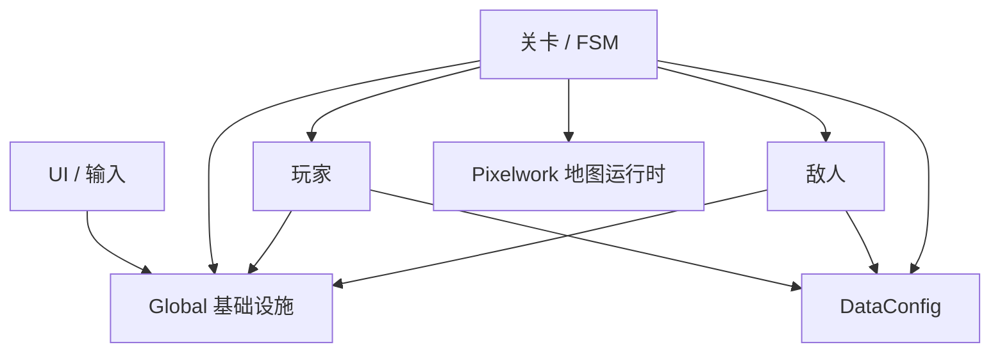
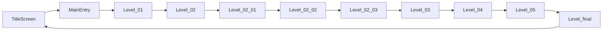
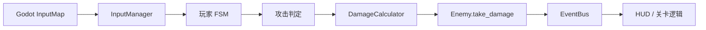
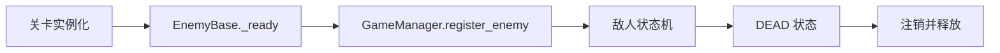
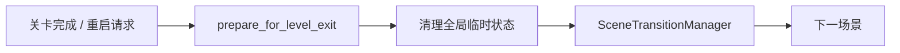

# HackathonGame 技术架构报告

> 唯一架构文档
>
> 更新日期：2026-08-22
>
> 目标引擎：Godot 4.6.2，GL Compatibility
>
> 文档依据：当前仓库静态扫描、关键链路检查与主场景 headless 启动验证

## 1. 项目定位与当前规模

本项目是一款 2D 横版动作叙事游戏，核心主题为“岭南文化 × 赛博未来 × 梦境撕裂”。游戏已经具备完整主线、玩家与敌人战斗系统、四阶段 Boss、剧情交互、数据配置、HUD、音频和像素地图运行时。

以下规模只统计游戏内容，排除 `LevelModule/Backup/`、`addons/godot_ai/` 和 Agent/MCP 工具文件：

| 类型 | 数量 |
|---|---:|
| GDScript (`.gd`) | 83 |
| 场景 (`.tscn`) | 38 |
| Resource 配置 (`.tres`) | 20 |
| Shader (`.gdshader`) | 8 |

项目入口在 `project.godot` 中配置为 `UI/TitleScreen.tscn`，基准视口为 1280×720，拉伸模式为 `canvas_items`。

## 2. 仓库分层

```text
project.godot
├─ .agents/ / .codex/   Agent 规则、Skills 与项目级 MCP 策略
├─ addons/godot_ai/     Godot AI 编辑器插件；不属于导出后的游戏运行架构
├─ Global/               全局状态、事件、输入、转场、音频
├─ LevelModule/
│  ├─ Formal/            正式关卡、FSM、Builder、关卡数据
│  ├─ Backup/            历史备份；不应成为正式运行依赖
│  └─ Scenes/            Pixelwork 地图及运行时脚本
├─ PlayerModule/Formal/  玩家基类、三种角色形态、相机
├─ EnemyModule/Formal/   敌人基类、普通敌人、花旦 Boss
├─ DataConfig/           玩家、敌人、关卡、技能 Resource
├─ UI/                   标题页、HUD、按键设置
├─ Tools/                弹体、交互物、伤害、代码雨等复用组件
├─ Assets/               图像、动画、音频、视频、UI 素材
└─ Resources/            共享资源
```

依赖方向应保持为：



跨模块通信优先经过 `EventBus` 和 `GameManager`。关卡可以装配玩家、敌人和 UI，但玩家或敌人不应反向依赖具体关卡脚本。

## 3. 主流程与场景生命周期

### 3.1 主线顺序



`TitleScreen` 通过 `SceneTransitionManager` 进入 `MainEntry`。`MainEntry` 实例化 `Level_01`，订阅 `LEVEL_COMPLETE`，并在前半段流程中以替换子节点的方式承载关卡。

当前转场模型并未完全统一：

- `Level_03` 在 `MainEntry` 托管时发送 `LEVEL_COMPLETE`，独立运行时直接切场景。
- `Level_04` 当前直接请求切换到 `Level_05`。
- `Level_05` 当前直接请求切换到 `Level_final`。
- 因此从 `Level_04` 离开后会替换整棵场景树，`MainEntry` 不再继续托管后半段流程。

这是现状描述，不是推荐的新关卡模板。后续应统一为一种主线转场模式，避免两种生命周期并存。

### 3.2 Level 02 的梦境分支

`Level_02_03` 是关键的数据分岔点：

```mermaid
flowchart TD
    CHAT[终端交互] --> MEMORY[/memory]
    MEMORY --> F1[复战区域 01]
    MEMORY --> F2[复战区域 02]
    F1 --> BACK[返回现实房间]
    F2 --> BACK
    BACK --> CONFIG[/config]
    CONFIG --> FLAGS[GameManager.dream_runtime_flags]
    FLAGS --> L3[Level_03 应用能力配置]
```

`/memory` 进入两个复战场景并记录返回原因；完成记忆条件后，`/config` 写入 `GameManager.dream_runtime_flags`。`Level_03` 读取这些标记，应用跳跃能力、伤害减免及外部信号相关规则。

这条 Dictionary 数据链跨越场景边界，键名目前没有编译期检查，是后续配置类型化的重点。

## 4. 全局基础设施

`project.godot` 当前注册 8 个游戏运行 Autoload：

| 单例 | 核心职责 |
|---|---|
| `GlobalDefine` | 运行模式、状态、事件名、碰撞层等常量 |
| `EventBus` | 跨模块事件订阅、广播和延迟广播 |
| `GameManager` | 玩家、敌人、关卡、检查点、暂停和跨关卡状态 |
| `InputManager` | 游戏动作分发、动作屏蔽和全局输入锁 |
| `KeybindManager` | 按键映射读取、修改和持久化 |
| `MusicManager` | BGM 播放、淡入淡出及暂停联动 |
| `SFXManager` | 音效播放、实例管理和防抖 |
| `SceneTransitionManager` | 切场景、检查点重启和转场清理 |

Godot AI 插件还会注册编辑器联动专用的 `_mcp_game_helper`。该 helper 用于编辑器启动的游戏进程与 MCP 捕获，不属于上述游戏架构；插件的导出钩子会在构建快照中移除它。当前工具基础设施基线为 Godot AI 3.1.5，项目目标引擎继续明确锁定为 Godot 4.6.2，不随上游版本自动迁移。MCP 的项目作用域、权限和协作规则以 `.codex/README.md` 为准。

### 4.1 运行模式

`GameManager` 根据当前场景路径区分正式模式和 `SelfTest` 模式。正式主线与局部测试场景共享核心模块，但测试场景不得写入正式场景链路或成为正式资源依赖。

### 4.2 全局状态边界

允许跨场景保留的状态应集中在 `GameManager`，例如：

- `player_ref`、`current_level`
- `enemy_list`
- 暂停、游戏结束、对话状态
- 检查点状态
- `dream_runtime_flags`

任何临时关卡状态如果写入全局层，都必须在转场或新流程开始时明确清理。

## 5. 核心数据流

### 5.1 输入到战斗



玩家持续移动和跳跃采用每帧轮询；离散动作通过 `InputManager` 分发。伤害由通用计算器和目标配置共同决定，结果再通过事件同步到 HUD、关卡目标和特效。

### 5.2 敌人生命周期



敌人基类已经在 `_ready()` 自动注册。任何生成器在 `add_child()` 后再次手工注册，都会造成同一实例重复出现在 `enemy_list`。

### 5.3 场景切换



转场必须恢复暂停、输入、音乐、玩家和敌人引用，并清理只属于当前场景的对话或 UI 状态。遗漏的全局布尔值会污染下一关。

### 5.4 地图数据

Pixelwork 生成数据由 `LevelModule/Scenes/PixelworkMapStitch/` 下的运行时脚本读取，再生成地图层、碰撞和关卡节点。地图源数据与运行时装配脚本必须同步维护；只替换图片而不更新碰撞数据，会产生视觉和物理边界不一致。

## 6. 关卡架构

正式关卡通常由以下部分组成：

- 主场景 `.tscn`
- 主控脚本 `.gd`
- FSM 或阶段枚举
- SceneBuilder / UIBuilder
- `LevelConfig` 或关卡专用数据资源
- Pixelwork 地图运行时（部分关卡）

| 关卡 | 主要职责 |
|---|---|
| `Level_01` | 教学、基础交互和叙事引导 |
| `Level_02`～`Level_02_03` | 多段梦境流程、终端、记忆复战和配置注入 |
| `Level_03` | 应用跨关卡配置、城市场景、能力变化和战斗推进 |
| `Level_04` | 维度侵蚀、空间崩塌和世界切换 |
| `Level_05` | 双世界、双角色独立血量、侵蚀值和花旦 Boss |
| `Level_final` | 终局展示并返回标题页 |

复杂度较高的脚本包括：

| 文件 | 当前行数 |
|---|---:|
| `Level_02_03.gd` | 1969 |
| `Level_05.gd` | 1419 |
| `Level_03.gd` | 1317 |
| `Level_04.gd` | 1311 |
| `Enemy_BossHuadan.gd` | 1163 |

这些文件同时承担阶段状态、生成、剧情、UI 和转场，后续优先按“阶段控制器 + 配置资源 + Builder”拆分。

## 7. 玩家、敌人与 Boss

### 7.1 玩家

`PlayerBase` 负责通用生命、受伤、死亡、状态切换、输入接入和事件同步。三个正式形态在基类之上扩展：

- `Player_Warrior`
- `Player_Warrior_Cyber`
- `Player_Warrior_Lingnan`

`SmoothCamera` 负责跟随与关卡边界。形态切换时需要同步位置、方向、摄像机限制、能力标记和对应生命值。

### 7.2 普通敌人

`EnemyBase` 提供感知、追踪、攻击、受伤、死亡和全局注册。具体敌人通过 `EnemyConfig` 和子类行为扩展。玩家范围攻击会遍历 `GameManager.enemy_list`，因此列表必须满足实例唯一性。

### 7.3 花旦 Boss

花旦 Boss 使用独立多阶段逻辑，包含阶段转换、攻击模式、剑气、灯笼/演出和死亡收束。Boss 继承通用敌人语义，但对阶段和死亡流程有重写；修改基类生命周期时必须同时检查 Boss 重写。

## 8. UI、音频与视觉层

### 8.1 HUD

`UI/HUD.gd` 订阅生命、Boss、侵蚀、任务和关卡事件，负责常驻战斗信息、暂停界面及部分关卡特效。HUD 应通过 `GameManager.current_level` 判断实际关卡，不应只依赖 `SceneTree.current_scene`，因为前半段关卡是 `MainEntry` 的子节点。

### 8.2 音频

`MusicManager` 管理 BGM，`SFXManager` 管理短音效。关卡配置可保存音频路径，但运行时加载前应检查资源存在性，避免缺失资源直接产生错误日志。

### 8.3 Shader 与工具

项目包含代码雨、侵蚀、警告屏障、弹体和其他视觉工具。Shader 或材质在 headless/dummy 渲染器下的结果不能完全代表图形后端，涉及画面效果的修复必须再做一次可视化检查。

## 9. 配置与资源边界

`DataConfig/` 使用 `.tres` 将部分平衡参数与脚本分离：

- `PlayerConfig`：生命、移动、跳跃、攻击等
- `EnemyConfig`：生命、速度、感知、伤害等
- `LevelConfig` / 关卡数据：出生点、相机范围、流程文本、下一关路径等
- 技能配置：冷却、伤害和技能参数

原则：

1. 数值平衡优先进入 Resource，不继续散落在关卡脚本中。
2. 正式场景只能引用正式配置路径。
3. `Backup/` 只保存历史参考，不得与正式资源共用 UID。
4. 所有资源路径大小写必须与磁盘文件名完全一致，以保证 Windows、Web 和 Linux 行为一致。
5. 资源可选时先用 `ResourceLoader.exists()` 检查；资源必需时应在启动验证中明确失败。

## 10. 已确认问题与修复边界

### 10.1 可直接修复的代码问题

以下问题不需要新增美术、音频、文案或策划数值：

| 优先级 | 问题 | 影响 |
|---|---|---|
| P0 | 敌人在 `_ready()` 自动注册后又被部分生成器手工注册 | 范围攻击可能对同一实例重复结算，注销后残留条目 |
| P0 | `Level_03` 通过受伤后回血实现减伤 | 致死攻击可能先进入死亡/失败状态，再被延迟回血 |
| P0 | 转场清理未复位对话状态 | 下一关敌人可能持续无法锁定玩家 |
| P0 | `EnemyBase` 与 Boss 在设置 `is_dead` 后才切换 `DEAD` | 状态切换被自身早退条件拦截 |
| P1 | `EventBus` 的延迟调用无法兑现同步错误隔离语义 | 调用结果不可信，退出清理可能重复绑定 |
| P1 | 输入屏蔽只使用全局计数，没有所有者 | 一个模块可能误解除另一个模块的输入锁 |
| P1 | HUD 使用 `current_scene` 判断正式关卡 | `MainEntry` 托管时关卡专属效果判断错误 |
| P1 | 敌人资源目录存在大小写不一致引用 | Windows 可运行，但 Web/Linux 导出存在加载失败风险 |

### 10.2 需要架构决策但不需要新资产

| 问题 | 需要决定的事项 |
|---|---|
| 主线存在两种转场模型 | 统一由 `MainEntry` 托管，或明确从某关开始整树切换 |
| `Backup/` 与正式配置存在 UID/路径耦合；当前编辑器审计记录 2 条 UID 重复和 22 条无效 UID 回退 | 先迁移正式引用，再隔离或移除备份资源，并逐项重新生成明确归属的 UID |
| `dream_runtime_flags` 使用字符串 Dictionary | 是否改为强类型 Resource 或专用数据对象 |
| 大型关卡脚本职责过多 | 确定按阶段、系统还是场景区域拆分 |

### 10.3 需要资产或人工验证

| 问题 | 外部条件 |
|---|---|
| `Assets/UI/skill_icon.png` 缺失 | 需要补图；代码只能安全降级为文本 |
| `Level02Data.tres` 的三条音频路径缺失 | 需要提供音频或人工选择替代资源 |
| `WarningBarrier` 材质在 dummy 渲染器报错 | 需要图形环境进行视觉 QA |
| Git 对象体积较大 | 历史清理或 Git LFS 迁移需要团队协作决定 |

## 11. 开发与扩展约定

### 11.1 新增关卡

1. 继承 `LevelBase` 或沿用正式关卡初始化协议。
2. 将阶段流转放入 FSM，将节点构建放入 Builder。
3. 通过配置资源提供出生点、相机边界、文本和下一关路径。
4. 使用统一的主线转场协议。
5. 为转场实现输入、暂停、音频、对话和全局引用清理。

### 11.2 新增敌人

1. 继承 `EnemyBase`。
2. 新增独立 `EnemyConfig`。
3. 生成后依赖基类自动注册，不再手工注册。
4. 死亡时只执行一次状态切换、注销和释放。
5. 验证单体伤害、范围伤害、暂停与转场行为。

### 11.3 新增事件

1. 在 `GlobalDefine.EventName` 定义事件常量。
2. 明确 payload 字段和类型。
3. 使用 `EventBus.subscribe()` / `emit()`。
4. 节点退出时确保连接和订阅被清理。
5. 不在业务脚本里散落字符串事件名。

### 11.4 新增资源

1. 使用 `res://` 规范路径并保持大小写一致。
2. 确认导入文件和源文件同时存在。
3. 不复用备份资源 UID。
4. 在目标 Godot 版本中重新导入并验证场景。
5. 音画资产必须进行人工试听或视觉确认。

## 12. 当前验证基线

本次扫描确认：

- 主要 GDScript 均可解析，未发现语法错误。
- 标题页和主线主要场景均可实例化并完成 `_ready()`。
- Godot 4.6.2 headless 启动主场景成功。
- 项目目前没有自动化单元测试或持续集成基线。
- GUI 编辑器审计记录 24 条既有 UID 警告：2 条 UID 重复、22 条无效 UID 回退，涉及备份、正式关卡、DataConfig 与 UI；这些警告不是 MCP 引入的。
- 强制短时退出会出现资源仍在使用的退出日志，不等同于正常游玩崩溃。

每轮结构性修改至少执行：

1. `git diff --check`
2. Godot 4.6.2 headless 主场景启动
3. 受影响关卡独立实例化
4. 正式主线相邻场景转场验证
5. 涉及 shader、动画、音频时追加人工画面或试听检查

## 13. 当前工作顺序建议

1. 先修复第 10.1 节的 P0 纯代码问题。
2. 再处理 P1 的事件、输入、HUD 和跨平台路径问题。
3. 决定并统一主线转场模型。
4. 迁移正式场景对备份资源的引用，再治理 UID。
5. 补齐缺失 UI 与音频资产。
6. 为主线、伤害结算、转场清理和敌人注册建立最小自动化回归测试。

这份文件是仓库唯一架构文档。架构、主线流程、全局契约或风险状态发生变化时，应直接更新本文件，避免再创建并行版本。
